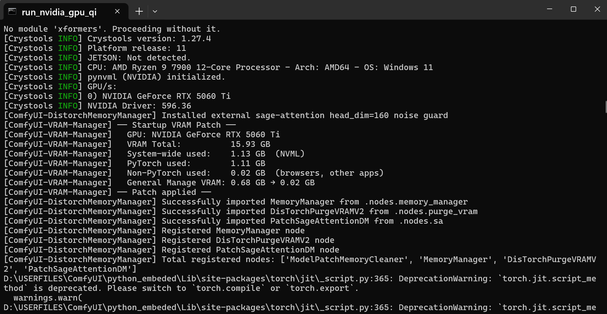
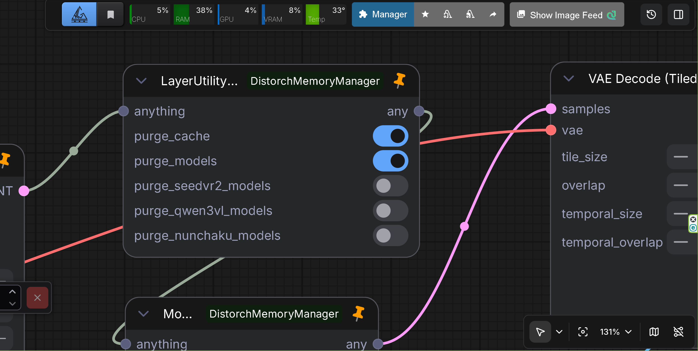
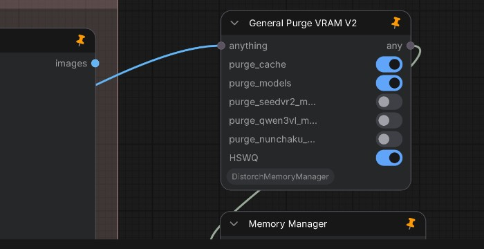
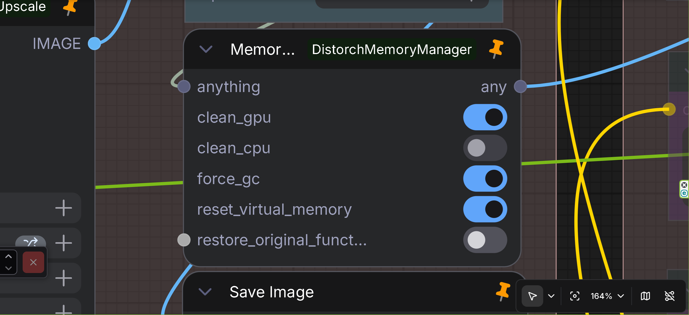
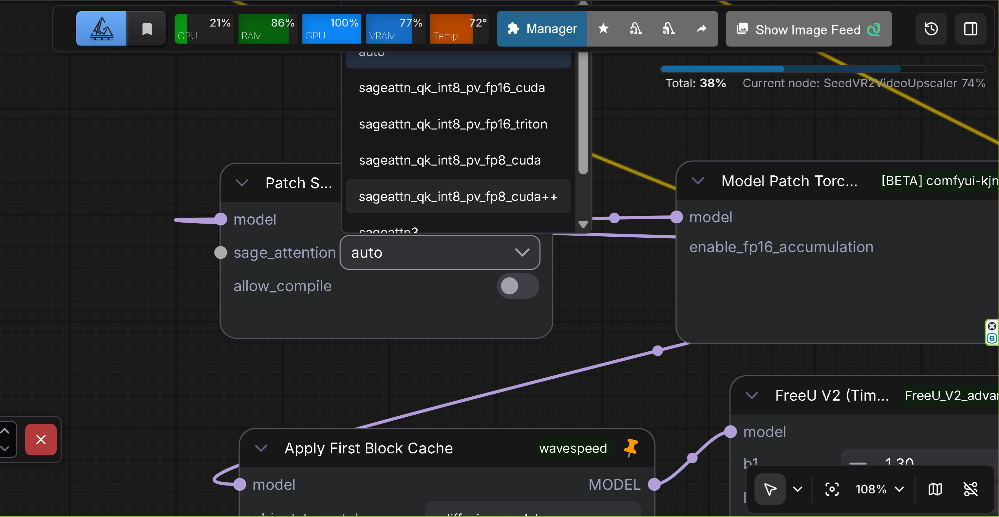

# ComfyUI-VRAM-Manager

<table align="center">
  <tr>
    <td align="center" bgcolor="#e5e7eb" width="88" height="36"><a href="../README.md"><font color="#4b5563"><b>EN</b></font></a></td>
    <td align="center" bgcolor="#d4465e" width="88" height="36"><font color="#ffffff"><b>中文</b></font></td>
  </tr>
</table>

<p align="center">
  
</p>

**ComfyUI-VRAM-Manager**（原 ComfyUI-DistorchMemoryManager）是 ComfyUI 的独立显存管理自定义节点。提供 Distorch 显存管理功能，高效处理 GPU/CPU 内存。支持清理 SeedVR2、Qwen3-VL、Nunchaku 模型（FLUX/Z-Image/Qwen-Image）、HSWQ 以及 Ollama 服务端显存。包含面向 ModelPatchLoader 工作流的 Model Patch Memory Cleaner。通过 NVML 自动检测非 PyTorch 的 VRAM 占用，在多进程环境下防止 OOM。

## 概述

本自定义节点用于解决 WAN2.2 等视频生成工作流中的 OOM（内存不足）问题。关键在于：这些 OOM **往往由系统内存（RAM）不足引起，而非 VRAM 不足**（即使在 64GB 内存的系统上，也可能因分辨率与视频长度而出现）。

这是专为 Distorch 显存管理设计的完全原创实现。放入 `custom_nodes` 文件夹即可轻松安装与卸载。

## 功能

### General Manage VRAM（启动时自动补丁 — v2.4.0 新增）

<p align="center">
  
</p>

* **说明**：在 ComfyUI 启动时全自动运行的 GPU 全局 VRAM 余量优化器。通过 NVML 自动检测系统级非 PyTorch VRAM 占用（浏览器、Discord、OBS、桌面窗口管理器等），并在加载时动态配置 ComfyUI 的 VRAM 管理。

##### 标准 ComfyUI 的核心局限
* **仅识别 PyTorch 占用**：默认情况下，**ComfyUI 只能识别 PyTorch 框架内的活跃 VRAM 分配。**
* **问题**：标准 ComfyUI **完全无法感知** 外部非 PyTorch 应用（浏览器、Discord、OBS、桌面合成器等）占用的物理 VRAM。因无法检测这部分开销，ComfyUI 常会高估可用 VRAM，加载大模型时突然 OOM。
* **解决方案**：本启动补丁使用 NVML 查询 GPU 的物理 VRAM 占用，计算系统总占用与 PyTorch 活跃内存的差值，并用该真实值覆盖 ComfyUI 的余量上限（`General Manage VRAM`），保证多进程下的内存安全。

##### 主要优势与特性
* **零节点配置**：仅在启动时后台运行。无需在工作流中放置节点、手动连线或开关。
* **NVML 精确检测**：使用 `pynvml`（NVIDIA Management Library）API 查询物理 GPU 内存实时状态。
* **依赖自动更新**：每次加载 ComfyUI 时（以及通过 ComfyUI-Manager 的 `install.py`），以 `pip install -U` 升级 `nvidia-ml-py`，无需手动升级即可保持 NVML 绑定为最新。
* **可靠的多进程 OOM 防护**：在加载时通过「系统物理占用 − PyTorch 分配」动态修补 ComfyUI 内部 VRAM 余量缓冲。
* **针对 iGPU/dGPU 多 GPU 环境优化**：
  * 适合将 Windows 桌面渲染与浏览器加速交给 CPU 核显（如 Ryzen 9 7900 内置 Radeon iGPU），独显 RTX 专用于 CUDA 的场景。
  * 启动补丁可检测极低的非 PyTorch 开销（例如 `0.02 GB`），自动将默认保留的 `0.68 GB` 缩减为 `0.02 GB`，最大化 ComfyUI 可用内存。

---

### 四类节点

#### Model Patch Memory Cleaner（v1.2.0 新增）

<p align="center">
  
</p>

* **说明**：专用于 ModelPatcher 已加载模型补丁的内存清理器
* **功能**：清理通过 ModelPatchLoader 加载的模型补丁，防止放大时 OOM
* **输入**：任意类型 (ANY) 透传
* **输出**：任意类型 (ANY) 透传
* **选项**：
  * `clear_model_patches`：清理 ModelPatchLoader 加载的模型补丁（默认：True）
  * `clean_gpu`：清理 GPU 内存（默认：True）
  * `force_gc`：强制垃圾回收（默认：True）
* **使用场景**：在 ModelPatchLoader（如 Z-Image ControlNet、QwenImage BlockWise ControlNet、SigLIP MultiFeat Proj）之后、放大操作之前放置本节点以防 OOM。面向通过 ModelPatchLoader 加载的补丁模型格式，与标准 ControlNet 不同。
* **技术细节**：
  * 检测带有 `additional_models` 或 `attachments` 中含模型补丁的 ModelPatcher 实例
  * 安全地从 VRAM 卸载模型补丁
  * 执行 `cleanup_models_gc()` 防止内存泄漏

#### General Purge VRAM V2（v1.10，v1.2.0 / v2.0.0 / v2.2.0 / v2.4.1 / v2.4.2 / v2.4.3 增强）

<p align="center">
  
</p>

* **说明**：Distorch 套件节点 **General Purge VRAM V2**（原 LayerStyle `LayerUtility: Purge VRAM V2`；类 id `DisTorchPurgeVRAMV2`），增强模型卸载、SeedVR2 / Qwen3-VL / Nunchaku 清理；v2.4.1 新增 **`HSWQ`** 开关；v2.4.2 在 **`HSWQ`** 下方新增 **`Ollama`** 开关，用于零残留清理 Ollama 服务端显存；v2.4.3 在 HSWQ Method **2c** 中额外清空 HSWQ **NVFP4** 运行时池 / CUDA graphs，避免 purge 后第二次 ConvRot NVFP4 生成出现 `quantize_nvfp4` / `PyCapsule` / `pooled TC path failed`
* **功能**：沿用 LayerStyle 原版 UI/行为谱系；类 id `DisTorchPurgeVRAMV2` 保留旧工作流兼容。v1.2.0 增强更激进的模型卸载与错误处理。v2.0.0 增加 Qwen3-VL 与 Nunchaku 清理。v2.2.0 增加 Nunchaku SDXL。v2.4.1 增加专用 **`HSWQ`** 清理流水线（PinCache 排空、PromptExecutor/SEGS 就地清空、HostUnregister、`comfy_kitchen` CUDA workspace 重置）。v2.4.2 增加 **`Ollama`** 清理，覆盖 **comfyui-ollama** 与 **comfyui-ollama-describer**（含 describer 默认 `keep_model_alive=-1`）。v2.4.3 在 kitchen 重置之外，通过 `sys.modules` 扫描 `nvfp4_runtime` 并调用 `clear_nvfp4_runtime_pools()`；优先从 `nodes/purge_vram.py` 导入；日志前缀 `HSWQ INT8/NVFP4:`。支持 SeedVR2 DiT/VAE、Qwen3-VL、Nunchaku（FLUX/Z-Image/Qwen-Image/SDXL）、HSWQ（含 NVFP4）及 Ollama 服务端卸载。
* **输入**：任意类型 (ANY) 透传
* **选项**：
   * `purge_cache`：执行 `gc.collect()`、刷新 CUDA 缓存、调用 `torch.cuda.ipc_collect()`
   * `purge_models`：增强模型卸载（v1.2.0）：
     * 调用 `cleanup_models()` 移除无效模型
     * 调用 `cleanup_models_gc()` 进行垃圾回收
     * 将所有模型标记为未使用
     * 通过 `model_unload()` 积极卸载
     * 若可用则调用 `soft_empty_cache()`
   * `purge_seedvr2_models`：从缓存清理 SeedVR2 DiT 与 VAE
     * 清理 SeedVR2 GlobalModelCache 中所有缓存的 DiT
     * 清理所有缓存的 VAE
     * 清理 runner 模板
     * 使用 SeedVR2 的 `release_model_memory()` 正确释放
   * `purge_qwen3vl_models`：从 GPU 清理 Qwen3-VL（v2.0.0）
     * 在 sys.modules 与 gc.get_objects() 中搜索 Qwen3-VL
     * 处理 device_map="auto" 的多设备模型
     * 清理参数、缓冲区与内部状态
   * `purge_nunchaku_models`：清理 Nunchaku（FLUX/Z-Image/Qwen-Image/SDXL）（v2.0.0，v2.2.0 增强）
     * 支持 NunchakuFluxTransformer2dModel、NunchakuZImageTransformer2DModel、NunchakuQwenImageTransformer2DModel、NunchakuSDXLUNet2DConditionModel（v2.2.0）
     * 清理前禁用 CPU offload
     * 在 sys.modules、ComfyUI current_loaded_models、gc.get_objects() 中搜索
     * 清理 cache 与临时数据属性（v2.2.0）
     * 处理带 diffusion_model 的 NunchakuSDXL 包装类（v2.2.0）
   * `HSWQ`：清理 HSWQ 残留 GPU（及相关主机）内存 — 面向完整 HSWQ 路径，非仅 INT8（v2.4.1；NVFP4 Method **2c** 见 v2.4.3）
     * 强制导入并排空 HSWQ PinCache；就地清空 PromptExecutor / SEGS 缓存（不在 prompt 中途调用 `reset()`）
     * 适用时通过 HostUnregister 释放 PINNED_MEMORY
     * 核清理后重置 `comfy_kitchen` CUDA workspace / empty-tensor 缓存（Method **2c**），使 purge+reload（含 INT8 GEMM）仍可用
     * （v2.4.3）kitchen 重置后，扫描 `sys.modules` 中的 `nvfp4_runtime` 并调用 `clear_nvfp4_runtime_pools()`，清空 HSWQ **NVFP4** 运行时池 / CUDA graphs
     * UI 标签为 **`HSWQ`**；仍接受旧工作流 kwargs `"HSWQ INT8"`；日志前缀 `HSWQ INT8/NVFP4:`
   * `Ollama`：清理 **comfyui-ollama** 与 **comfyui-ollama-describer** 加载的 Ollama 服务端显存（v2.4.2）
     * 节点 UI 中位于 **`HSWQ`** 正下方（见上方截图）
     * 针对 describer 默认 `keep_model_alive=-1`（模型常驻直至显式卸载）
     * 从两个自定义节点包收集 `api_host` / `url`；循环 `GET /api/ps` 直至为空
     * 发送 `/api/generate` 与 `/api/chat` 且 `keep_alive=0`；执行 `ollama stop`；可用时走 Client API 回退
     * 清空进程内 `CHAT_SESSIONS` / `saved_context`；删除 `saved_context/` 文件；最终 `/api/ps` 验证
* **v1.2.0 增强**：
  * 更激进的模型卸载与完善错误处理
  * 对所有方法调用进行 None 与 callable 检查
  * 改进错误信息与日志
  * 安全处理 real_model 为 None 的模型
  * 支持清理 SeedVR2 DiT/VAE
* **v2.0.0 增强**：
  * Qwen3-VL 清理，支持 device_map="auto"
  * Nunchaku 清理（FLUX/Z-Image/Qwen-Image），含 CPU offload 处理
  * 增强多设备 CUDA 缓存清理
  * 完善的调试日志
  * 修复 any() 与 AnyType 名称冲突
  * 显示名称改为 ComfyUI-VRAM-Manager
* **v2.2.0 增强**：
  * Nunchaku SDXL（NunchakuSDXLUNet2DConditionModel）
  * NunchakuSDXL 包装类检测与处理
  * 所有 Nunchaku 检测路径的 cache 与临时数据清理
  * 更积极的垃圾回收（3 次 gc.collect()）与 CUDA 缓存清理
  * 改进 Nunchaku SDXL VRAM 释放（约 2.5GB）
  * 在清理顶层参数的同时保留模型结构
* **v2.4.1 增强**：
  * 专用 **`HSWQ`** 开关，完整清理 HSWQ 显存
  * PinCache 强制导入/排空、PromptExecutor/SEGS 就地清空、HostUnregister
  * Method **2c**：核清理后重置 `comfy_kitchen` CUDA workspace / empty-tensor 缓存
  * fallback `nodes/purge_vram.py` 与根目录节点同步
* **v2.4.2 增强**：
  * DisTorchPurgeVRAMV2 新增 **`Ollama`** 开关（位于 **`HSWQ`** 下方）
  * 零残留清理 **comfyui-ollama** 与 **comfyui-ollama-describer** 的 Ollama 显存
  * `/api/ps` 循环至空、`keep_alive=0` 的 generate/chat、`ollama stop`、Client 回退
  * 清空 `CHAT_SESSIONS`、`saved_context` 及磁盘 `saved_context/` 文件
  * fallback `nodes/purge_vram.py` 与根目录节点同步
* **v2.4.3 增强**：
  * HSWQ Method **2c** 在 kitchen 重置之外，通过 `sys.modules` 扫描 + `clear_nvfp4_runtime_pools()` 清空 HSWQ **NVFP4** 运行时池 / CUDA graphs
  * 避免 purge 后第二次 ConvRot NVFP4 生成失败（`quantize_nvfp4` / `PyCapsule` / `pooled TC path failed`）
  * 优先从 `nodes/purge_vram.py` 导入 `DisTorchPurgeVRAMV2`；日志前缀 `HSWQ INT8/NVFP4:`
* **原因**：上游 LayerStyle 节点消失，在此复刻以保留旧工作流。v1.2.0 改进内存管理。SeedVR2 支持独立缓存系统。v2.0.0 支持 ComfyUI 标准 model_management 未管理的 Qwen3-VL/Nunchaku。v2.2.0 支持需特殊处理的 Nunchaku SDXL。v2.4.1 针对通用 unload / DistTorch 普通 purge 无法完全回收的 HSWQ 残留。v2.4.2 针对 comfyui-ollama / comfyui-ollama-describer（尤其 `keep_model_alive=-1`）加载的 Ollama 模型无法被标准 ComfyUI 或 HSWQ 清理单独释放的问题。v2.4.3 针对仅 kitchen Method **2c** 无法清掉的 HSWQ **NVFP4** 运行时池 / CUDA graphs，purge 后下一次 ConvRot NVFP4 生成会失败的问题。

#### Memory Manager（高级）

<p align="center">
  
</p>

* **说明**：综合内存管理节点（面向高级用户）
* **功能**：详细内存管理，含 UI 损坏防护与通用 VRAM 管理
* **输入**：任意类型 (ANY)
* **输出**：任意类型 (ANY)
* **选项**：
   * `clean_gpu`：清理 GPU 内存
   * `clean_cpu`：清理 CPU 内存（慎用）
   * `force_gc`：强制垃圾回收
   * `reset_virtual_memory`：重置虚拟内存
   * `restore_original_functions`：恢复原始函数

#### Patch Sage Attention DM（v2.3.0 新增）

<p align="center">
  
</p>

* **说明**：实验性节点，将 ComfyUI 注意力机制补丁为 SageAttention
* **功能**：用 SageAttention 替换标准注意力，提升内存效率与性能
* **输入**：模型 (MODEL)
* **输出**：模型 (MODEL)
* **选项**：
  * `sage_attention`：SageAttention 模式
    * `disabled`：禁用（恢复原版注意力）
    * `auto`：自动实现
    * `sageattn_qk_int8_pv_fp16_cuda`：CUDA（QK int8，PV FP16）
    * `sageattn_qk_int8_pv_fp16_triton`：Triton（QK int8，PV FP16）
    * `sageattn_qk_int8_pv_fp8_cuda`：CUDA（QK int8，PV FP8）
    * `sageattn_qk_int8_pv_fp8_cuda++`：CUDA（QK int8，PV FP8，优化版）
    * `sageattn3`：SageAttention 3（Blackwell）
    * `sageattn3_per_block_mean`：SageAttention 3（per-block mean）
  * `allow_compile`：允许对 SageAttention 使用 torch.compile（需 sageattn 2.2.0+，默认 False）
* **使用场景**：用 SageAttention 替换注意力以节省显存、提升性能。每次模型执行时打补丁并在结束后自动清理。
* **技术细节**：
  * 使用 ComfyUI 回调（ON_PRE_RUN、ON_CLEANUP）动态打补丁
  * 自动检测 SageAttention 版本并记录详情
  * 禁用时检测并记录 Flash-Attention 状态
  * 通过 wrap_attn 兼容 ComfyUI 注意力格式
  * 支持多种实现（CUDA、Triton、SageAttention 3）

## 安装

1. 克隆或下载到 `ComfyUI/custom_nodes/`：

```bash
cd ComfyUI/custom_nodes
git clone https://github.com/ussoewwin/ComfyUI-DistorchMemoryManager.git
```

2. 安装依赖：

```bash
cd ComfyUI-DistorchMemoryManager
pip install -r requirements.txt
```

3. 重启 ComfyUI
4. 节点将出现在节点面板的「Memory」分类中

## 使用

### 基本用法

1. 在工作流中添加任意内存管理节点
2. 将任意数据连接到输入
3. 按需配置选项
4. 将输出连接到下一节点

### 推荐工作流位置

**ModelPatchLoader 工作流**：

```
[ModelPatchLoader] → [QwenImageDiffsynthControlnet] → [Model Patch Memory Cleaner] → [放大节点]
```

**通用内存管理**：

```
[上一节点] → [Memory Manager] → [下一节点]
```

### 推荐设置

**ModelPatchLoader 工作流（补丁模型格式）**：

* 使用 **Model Patch Memory Cleaner**
* `clear_model_patches: True`
* `clean_gpu: True`
* `force_gc: True`
* **放置位置**：ModelPatchLoader 使用之后、放大之前
* **注意**：面向 ModelPatchLoader 的补丁格式（如 Z-Image ControlNet、QwenImage BlockWise ControlNet、SigLIP MultiFeat Proj），与标准 ControlNet 不同。

**视频生成（WAN2.2 等）**：

* 使用 **Memory Manager**
* `clean_gpu: True`
* `force_gc: True`
* `reset_virtual_memory: True`

**最大内存释放**：

* 使用 **Memory Manager**
* `clean_cpu: True`（警告：可能导致 UI 异常）

## 故障排除

### 内存不足错误

**解决办法**：

1. ModelPatchLoader 工作流：在 ControlNet 使用后使用 **Model Patch Memory Cleaner**
2. 通用工作流：使用 **Memory Manager**
3. 启用 `clean_gpu` 与 `reset_virtual_memory`
4. 必要时启用 `force_gc`

### ModelPatchLoader 使用后放大时 OOM

**解决办法**：

1. 在 QwenImageDiffsynthControlnet（使用 ModelPatchLoader 时）之后添加 **Model Patch Memory Cleaner**
2. `clear_model_patches: True`
3. `clean_gpu: True`
4. `force_gc: True`
5. **注意**：适用于 ModelPatchLoader 补丁格式，非标准 ControlNet

### UI 损坏

**解决办法**：

1. 使用 **Model Patch Memory Cleaner** 或 **Memory Manager**
2. 保持 `clean_cpu` 关闭（若使用 Memory Manager）
3. 仅启用必要选项

### Qwen3-VL 模型 OOM

**解决办法**：

1. 使用 **DisTorchPurgeVRAMV2**
2. `purge_qwen3vl_models: True`
3. `purge_cache: True` 与 `purge_models: True`
4. 节点自动处理 device_map="auto"

### Nunchaku 模型 OOM（FLUX/Z-Image/Qwen-Image/SDXL）

**解决办法**：

1. 使用 **DisTorchPurgeVRAMV2**
2. `purge_nunchaku_models: True`
3. 清理前自动禁用 CPU offload
4. `purge_cache: True` 与 `purge_models: True`
5. 支持 NunchakuFluxTransformer2dModel、NunchakuZImageTransformer2DModel、NunchakuQwenImageTransformer2DModel、NunchakuSDXLUNet2DConditionModel（v2.2.0）
6. Nunchaku SDXL 可清理 cache 与临时数据，约释放 2.5GB VRAM（v2.2.0）

## 技术细节

### 已实现功能

* GPU 内存清理（`torch.cuda.empty_cache()`）
* GPU 同步（`torch.cuda.synchronize()`）
* CPU 内存清理（`gc.collect()`）
* 虚拟内存重置（`comfy.model_management.free_memory()`）
* 模型补丁检测与卸载（v1.2.0）
  * 检测带补丁的 ModelPatcher
  * 通过 `model_unload()` 安全卸载
  * 从 `current_loaded_models` 移除
  * `cleanup_models_gc()` 防泄漏
  * 处理 ModelPatchLoader 的异常补丁格式
* Qwen3-VL 模型清理（v1.4.0）
  * 在 sys.modules 与 gc.get_objects() 中搜索
  * 支持 device_map="auto"
  * 清理参数、缓冲区与内部状态
  * 支持 hf_device_map
* Nunchaku 模型清理（v1.4.0，v2.2.0 增强）
  * 支持 FLUX/Z-Image/Qwen-Image/SDXL 四类 Nunchaku 模型
  * 清理前禁用 CPU offload
  * 多路径搜索（sys.modules、current_loaded_models、gc.get_objects()）
  * 处理嵌套结构（ModelPatcher、ComfyFluxWrapper）
  * 清理 offload_manager
  * NunchakuSDXL 包装与 diffusion_model（v2.2.0）
  * 清理 _cache、_state_dict_cache 等（v2.2.0）
  * 更积极的 GC 与 CUDA 缓存清理（v2.2.0）

### 安全特性

* 防止 UI 损坏的安全实现
* 异常处理
* 渐进式内存清理
* 全面的 None 与 callable 检查（v1.2.0）
* cleanup_models() 与 is_dead() 的健壮错误处理

## 补充提示

* 扩大页面文件也可减少放大时的 OOM
* 注意：视频生成推理阶段 VRAM 紧张时，扩页面文件帮助有限
* ModelPatchLoader 工作流：放大前务必使用 Model Patch Memory Cleaner
* Qwen3-VL：使用 DisTorchPurgeVRAMV2 且 `purge_qwen3vl_models: True`
* Nunchaku（FLUX/Z-Image/Qwen-Image/SDXL）：`purge_nunchaku_models: True`；SDXL v2.2.0 约可释放 2.5GB
* SageAttention（v2.3.0）：使用 Patch Sage Attention DM；禁用可将 `sage_attention` 设为 `disabled` 再运行一次
* **多进程环境（v2.4.0）**：启动时通过 NVML 自动检测非 PyTorch VRAM 并应用于 General Manage VRAM，无需手动配置节点

## 许可证

Apache License 2.0 — 详见 LICENSE 文件

## 贡献

欢迎在 GitHub Issues 提交 Bug 与功能请求。

## 发行历史

详见 [CHANGELOG.md](changelog/changelog.md)。

## 关于

ComfyUI-VRAM-Manager（原 ComfyUI-DistorchMemoryManager）— 支持 Distorch 的 ComfyUI 独立显存管理自定义节点
