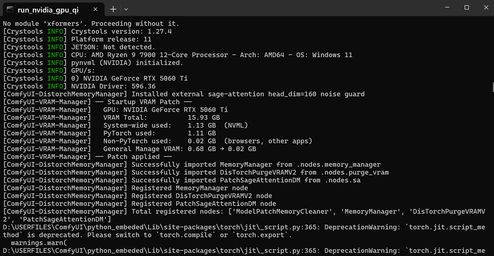
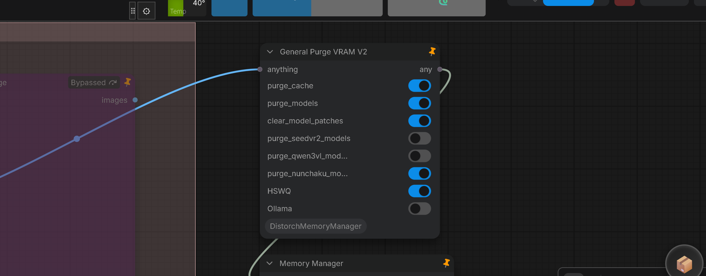
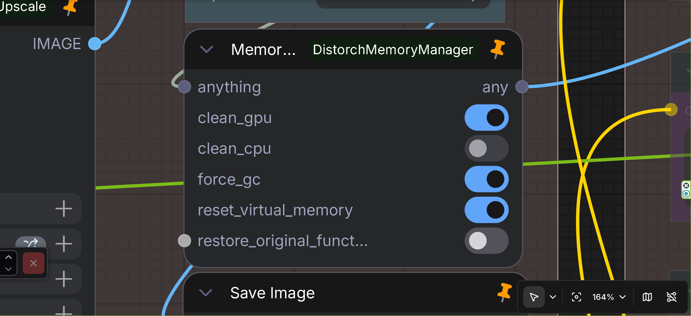
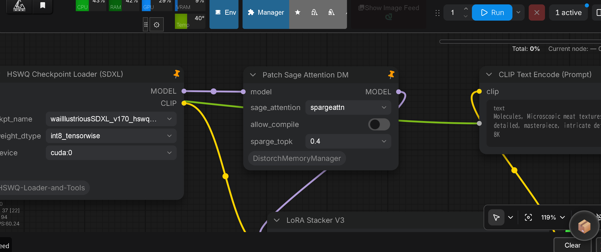

# ComfyUI-VRAM-Manager

<table align="center">
  <tr>
    <td align="center" bgcolor="#e5e7eb" width="88" height="36"><a href="../README.md"><font color="#4b5563"><b>EN</b></font></a></td>
    <td align="center" bgcolor="#d4465e" width="88" height="36"><font color="#ffffff"><b>中文</b></font></td>
  </tr>
</table>

<p align="center">
  
</p>

**ComfyUI-VRAM-Manager**（原 ComfyUI-DistorchMemoryManager）是 ComfyUI 的独立显存管理自定义节点。提供 Distorch 显存管理功能，高效处理 GPU/CPU 内存。支持清理 SeedVR2、Qwen3-VL、Nunchaku 模型（FLUX/Z-Image/Qwen-Image）、HSWQ 以及 Ollama 服务端显存。在 General Purge VRAM V2 中内置了面向 ModelPatchLoader 工作流的模型补丁清理（clear_model_patches）功能。通过 NVML 自动检测非 PyTorch 的 VRAM 占用，在多进程环境下防止 OOM。

## 概述

本自定义节点用于解决 WAN2.2 等视频生成工作流中的 OOM（内存不足）问题。关键在于：这些 OOM **往往由系统内存（RAM）不足引起，而非 VRAM 不足**（即使在 64GB 内存的系统上，也可能因分辨率与视频长度而出现）。

这是专为 Distorch 显存管理设计的完全原创实现。放入 `custom_nodes` 文件夹即可轻松安装与卸载。

## 功能

### General Manage VRAM（启动时自动补丁 — v2.4.0 新增）

<p align="center">
  
</p>

* **说明**：在 ComfyUI 启动时全自动运行的 GPU 全局 VRAM 余量优化器。通过 NVML 自动检测系统级非 PyTorch VRAM 占用（浏览器、Discord、OBS、桌面窗口管理器等），并在加载时动态配置 ComfyUI 的 VRAM 管理。

##### 标准 ComfyUI 的核心局限
* **仅识别 PyTorch 占用**：默认情况下，**ComfyUI 只能识别 PyTorch 框架内的活跃 VRAM 分配。**
* **问题**：标准 ComfyUI **完全无法感知** 外部非 PyTorch 应用（浏览器、Discord、OBS、桌面合成器等）占用的物理 VRAM。因无法检测这部分开销，ComfyUI 常会高估可用 VRAM，加载大模型时突然 OOM。
* **解决方案**：本启动补丁使用 NVML 查询 GPU 的物理 VRAM 占用，计算系统总占用与 PyTorch 活跃内存的差值，并用该真实值覆盖 ComfyUI 的余量上限（`General Manage VRAM`），保证多进程下的内存安全。

##### 主要优势与特性
* **零节点配置**：仅在启动时后台运行。无需在工作流中放置节点、手动连线或开关。
* **NVML 精确检测**：使用 `pynvml`（NVIDIA Management Library）API 查询物理 GPU 内存实时状态。
* **依赖自动更新**：每次加载 ComfyUI 时（以及通过 ComfyUI-Manager 的 `install.py`），以 `pip install -U` 升级 `nvidia-ml-py`，无需手动升级即可保持 NVML 绑定为最新。
* **可靠的多进程 OOM 防护**：在加载时通过「系统物理占用 − PyTorch 分配」动态修补 ComfyUI 内部 VRAM 余量缓冲。
* **针对 iGPU/dGPU 多 GPU 环境优化**：
  * 适合将 Windows 桌面渲染与浏览器加速交给 CPU 核显（如 Ryzen 9 7900 内置 Radeon iGPU），独显 RTX 专用于 CUDA 的场景。
  * 启动补丁可检测极低的非 PyTorch 开销（例如 `0.02 GB`），自动将默认保留的 `0.68 GB` 缩减为 `0.02 GB`，最大化 ComfyUI 可用内存。

---

### 三类节点

#### General Purge VRAM V2

<p align="center">
  
</p>

* **说明**：Distorch 套件核心节点 **General Purge VRAM V2**（原 LayerStyle `LayerUtility: Purge VRAM V2`；类 id `DisTorchPurgeVRAMV2`）。专用于强力清理标准 ComfyUI 垃圾回收机制无法触及的 GPU/CPU 残留显存与深层底层缓存。全面覆盖标准 ComfyUI 模型、ModelPatchLoader 模型补丁、SeedVR2、Qwen3-VL、Nunchaku（FLUX / Z-Image / Qwen-Image / SDXL）、完整 HSWQ 运行时链路（含 INT8 及 NVFP4 运行时池/CUDA 图）以及外部 Ollama 服务端进程。
* **功能**：
  * 通过类 id `DisTorchPurgeVRAMV2` 完整保持对 LayerStyle 原版旧工作流的向下兼容性。
  * 强力激进的模型卸载流水线，具备完备的异常处理、可调用校验与脱钩/None `real_model` 安全处理。
  * 将模型补丁深度清理无缝集成于 `clear_model_patches` 开关下，配备即时 CUDA 缓存刷新、GPU 同步与 GC 回收。
  * 针对专有第三方架构（SeedVR2、Qwen3-VL、Nunchaku、HSWQ、Ollama）的深层内存排空。
* **输入**：任意类型 (`ANY`) 透传
* **输出**：任意类型 (`ANY`) 透传
* **选项**：
  * `purge_cache`：执行 `gc.collect()`、刷新所有可用设备的 CUDA 缓存（`torch.cuda.empty_cache()`）、调用 `torch.cuda.ipc_collect()`。
  * `purge_models`：深度模型卸载流水线：
    * 调用 `cleanup_models()` 移除无效残留模型
    * 调用 `cleanup_models_gc()` 进行底层垃圾回收
    * 将所有活跃模型标记为未使用
    * 通过 `model_unload()` 强力卸载显存中的模型
    * 若 ComfyUI 运行环境中可用则调用 `soft_empty_cache()`
    * 包含健全的异常处理、`None` 检查与 `callable()` 校验（安全处理 `real_model` 为 `None` 的异常模型引用）
  * `clear_model_patches`：清理 ModelPatchLoader 加载的模型补丁（默认：`True`；完全继承并统一原独立 Model Patch Memory Cleaner 功能）：
    * 清理通过 ModelPatchLoader 加载的模型补丁（如 Z-Image ControlNet、QwenImage BlockWise ControlNet、SigLIP MultiFeat Proj），防止后续放大等重任务时显存溢出 OOM
    * 检测带有 `additional_models` 或 `attachments` 中含模型补丁的 `ModelPatcher` 实例
    * 通过 `model_unload()` 安全地从 VRAM 卸载模型补丁，并从 `current_loaded_models` 彻底移除
    * 执行 `cleanup_models_gc()`，并在卸载后立即执行 `torch.cuda.empty_cache()`、`torch.cuda.synchronize()` 与 `gc.collect()`，即便关闭 `purge_models` 也能即时物理解放显存
  * `purge_seedvr2_models`：从缓存清理 SeedVR2 DiT 与 VAE 模型：
    * 排空 SeedVR2 `GlobalModelCache` 中所有缓存的 DiT 模型
    * 排空 SeedVR2 `GlobalModelCache` 中所有缓存的 VAE 模型
    * 清理 runner 运行模板
    * 调用 SeedVR2 原生 API `release_model_memory()` 正确释放显存
  * `purge_qwen3vl_models`：从 GPU 显存深度清理 Qwen3-VL 模型：
    * 在 `sys.modules` 与 `gc.get_objects()` 中深度扫描活跃的 Qwen3-VL 实例
    * 完整支持多设备配置（`device_map="auto"`）
    * 释放模型参数、缓冲区与内部执行状态
  * `purge_nunchaku_models`：清理 Nunchaku 模型架构（FLUX / Z-Image / Qwen-Image / SDXL）：
    * 支持 `NunchakuFluxTransformer2dModel`、`NunchakuZImageTransformer2DModel`、`NunchakuQwenImageTransformer2DModel` 与 `NunchakuSDXLUNet2DConditionModel`
    * 清理前自动禁用 CPU offload 以防同步阻塞
    * 跨 `sys.modules`、ComfyUI `current_loaded_models` 与 `gc.get_objects()` 进行多层级检索
    * 彻底清理内部 cache 与临时数据属性
    * 针对带 `diffusion_model` 的 `NunchakuSDXL` 包装类进行穿透解包，在保留模型外层结构的同时释放顶层参数（可回收约 2.5GB 显存）
    * 执行强力垃圾回收（3 次 `gc.collect()`）与全设备 CUDA 缓存刷新
  * `HSWQ`：深度清理 HSWQ 残留 GPU、工作区及主机锁定内存（覆盖完整 HSWQ 路径，包含 INT8 及 NVFP4）：
    * 强制导入并排空 HSWQ `PinCache`；就地清空 `PromptExecutor` / `SEGS` 缓存（不在生成中途调用 `reset()` 打断任务）
    * 适用时通过 `HostUnregister` 彻底释放主机锁定内存 `PINNED_MEMORY`
    * 核心清理完成后重置 `comfy_kitchen` CUDA workspace / empty-tensor 缓存（Method **2c**），确保后续重新加载（含 INT8 GEMM）功能完好
    * 扫描 `sys.modules` 中的 `nvfp4_runtime` 并调用 `clear_nvfp4_runtime_pools()`（Method **2c**），彻底清空 HSWQ **NVFP4** 运行时池与 CUDA 图，杜绝后续第二次 ConvRot NVFP4 生成崩溃（`quantize_nvfp4` / `PyCapsule` / `pooled TC path failed`）
    * UI 标签显示为 **`HSWQ`**；向下兼容旧工作流参数 `"HSWQ INT8"`；日志前缀统一为 `HSWQ INT8/NVFP4:`
  * `Ollama`：清理由 **comfyui-ollama** 与 **comfyui-ollama-describer** 加载的外部 Ollama 服务端显存：
    * 节点 UI 中直接位于 **`HSWQ`** 正下方
    * 专门针对 describer 默认的 `keep_model_alive=-1`（导致模型在后台常驻直至显式卸载）
    * 自动抓取两套自定义节点包的 `api_host` / `url` 地址，循环轮询 `GET /api/ps` 直至列表清空
    * 发送带 `keep_alive=0` 的 `/api/generate` 与 `/api/chat` 卸载请求，执行 `ollama stop`，并在可用时走 Client API 备用路径
    * 清空进程内 `CHAT_SESSIONS` / `saved_context`，删除磁盘上的 `saved_context/` 文件，并通过最终 `/api/ps` 校验确保零残留显存占用
* **架构与设计原理**：
  * **工作流延续性**：通过类 id `DisTorchPurgeVRAMV2` 完整无缝平替已停更的 LayerStyle 节点，保障既有历史工作流正常运行。
  * **超越标准 ComfyUI Unload**：ComfyUI 标准 `model_management.unload_all_models()` 仅管理其内部模型注册表中记录的模型，无法触及外部框架、自定义运行器缓存或第三方后台服务。
  * **统一多引擎排空**：将 SeedVR2 独立模型缓存、Qwen3-VL 多设备自动映射、Nunchaku 特殊包装结构、HSWQ 锁定缓存/kitchen 工作区/NVFP4 CUDA 图、ModelPatchLoader 附属补丁以及外部 Ollama 服务端实例的显存回收，完全集中于单个节点一站式搞定，无需在工作流中串联多个冗余的独立清理节点。

#### Memory Manager（高级）

<p align="center">
  
</p>

* **说明**：综合内存管理节点（面向高级用户）
* **功能**：详细内存管理，含 UI 损坏防护与通用 VRAM 管理
* **输入**：任意类型 (ANY)
* **输出**：任意类型 (ANY)
* **选项**：
   * `clean_gpu`：清理 GPU 内存
   * `clean_cpu`：清理 CPU 内存（慎用）
   * `force_gc`：强制垃圾回收
   * `reset_virtual_memory`：重置虚拟内存
   * `restore_original_functions`：恢复原始函数

#### Patch Sage Attention DM（v2.3.0 新增）

<p align="center">
  
</p>

* **说明**：实验性节点，将 ComfyUI 注意力机制补丁为 SageAttention
* **功能**：用 SageAttention 替换标准注意力，提升内存效率与性能
* **输入**：模型 (MODEL)
* **输出**：模型 (MODEL)
* **选项**：
  * `sage_attention`：SageAttention 模式
    * `disabled`：禁用（恢复原版注意力）
    * `auto`：自动实现
    * `sageattn_qk_int8_pv_fp16_cuda`：CUDA（QK int8，PV FP16）
    * `sageattn_qk_int8_pv_fp16_triton`：Triton（QK int8，PV FP16）
    * `sageattn_qk_int8_pv_fp8_cuda`：CUDA（QK int8，PV FP8）
    * `sageattn_qk_int8_pv_fp8_cuda++`：CUDA（QK int8，PV FP8，优化版）
    * `sageattn3`：SageAttention 3（Blackwell）
    * `sageattn3_per_block_mean`：SageAttention 3（per-block mean）
    * `spargeattn`：**SpargeAttn-hswq**（v2.4.7）：基于 SageAttention2++ 量化内核的两阶段块稀疏注意力，通过 `spas_sage_hswq_attn` 包（Owner fork，与官方 `sageattention` 共存）实现。**预构建 Windows wheel 已发布在 Hugging Face：[Sage-Attention-and-Sparge-Attention-HSWQ](https://huggingface.co/ussoewwin/Sage-Attention-and-Sparge-Attention-HSWQ)** —— 选择匹配的 wheel 安装（cp3xx = Python 版本，torch2.xx / cu1xx = torch/CUDA 构建）。存在约束时回退到 PyTorch/SDPA 并输出日志：带注意力掩码、headdim 不是 64/128、或 seq_len < 128。用 `sparge_topk` 输入权衡精度与速度（默认 0.5；越低越稀疏/越快）。
  * `sparge_topk`（可选）：仅 `spargeattn` 模式使用的 KV 块保留比例（默认 0.5，范围 0.05–1.0）。越高保留越多块（更准确、加速少）；越低跳过越多块（更快、精度低）。其他模式忽略此参数。
  * `allow_compile`：允许对 SageAttention 使用 torch.compile（需 sageattn 2.2.0+，默认 False）
* **使用场景**：用 SageAttention 替换注意力以节省显存、提升性能。每次模型执行时打补丁并在结束后自动清理。
* **技术细节**：
  * 使用 ComfyUI 回调（ON_PRE_RUN、ON_CLEANUP）动态打补丁
  * 自动检测 SageAttention 版本并记录详情
  * SpargeAttn 模式：使用独立的 `get_sparge_func_dm()` 专用代码路径（与 SageAttention 各模式完全分离），调用 `spas_sage_hswq_attn.spas_sage2_attn_meansim_topk_cuda`（INT8 QK + FP8 PV 量化内核 + 两阶段块稀疏过滤）；E2-a scale sweep 可用 `SPARGE_SCALE_SWEEP=1` 开启
  * 禁用时检测并记录 Flash-Attention 状态
  * 通过 wrap_attn 兼容 ComfyUI 注意力格式
  * 支持多种实现（CUDA、Triton、SageAttention 3、SpargeAttn）

## 安装

1. 克隆或下载到 `ComfyUI/custom_nodes/`：

```bash
cd ComfyUI/custom_nodes
git clone https://github.com/ussoewwin/ComfyUI-DistorchMemoryManager.git
```

2. 安装依赖：

```bash
cd ComfyUI-DistorchMemoryManager
pip install -r requirements.txt
```

3. (For SageAttention / SpargeAttn nodes) Install prebuilt Windows wheels from the [Sage-Attention-and-Sparge-Attention-HSWQ](https://huggingface.co/ussoewwin/Sage-Attention-and-Sparge-Attention-HSWQ) Hugging Face repo - `sageattention` (SA2), `sageattn3` (SA3), and `spas_sage_hswq_attn` (SpargeAttn-hswq, used by the `spargeattn` mode) are published for multiple Python/torch/CUDA combos. Pick the wheel matching your environment (`cp3xx` = Python version, `torch2.xx` / `cu1xx` = torch/CUDA build).
4. 重启 ComfyUI
5. 节点将出现在节点面板的「Memory」分类中

## 使用

### 基本用法

1. 在工作流中添加任意内存管理节点
2. 将任意数据连接到输入
3. 按需配置选项
4. 将输出连接到下一节点

### 推荐工作流位置

**ModelPatchLoader 工作流**：

```
[ModelPatchLoader] → [QwenImageDiffsynthControlnet] → [General Purge VRAM V2 (clear_model_patches=True)] → [放大节点]
```

**通用内存管理**：

```
[上一节点] → [Memory Manager] → [下一节点]
```

### 推荐设置

**ModelPatchLoader 工作流（补丁模型格式）**：

* 使用 **General Purge VRAM V2** (`DisTorchPurgeVRAMV2`)
* `clear_model_patches: True`
* `purge_models: False`（可选，保留基础 Diffusion 模型同时卸载补丁模型）
* `purge_cache: True`
* **放置位置**：ModelPatchLoader 使用之后、放大之前
* **注意**：面向 ModelPatchLoader 的补丁格式（如 Z-Image ControlNet、QwenImage BlockWise ControlNet、SigLIP MultiFeat Proj），与标准 ControlNet 不同。

**视频生成（WAN2.2 等）**：

* 使用 **Memory Manager**
* `clean_gpu: True`
* `force_gc: True`
* `reset_virtual_memory: True`

**最大内存释放**：

* 使用 **Memory Manager**
* `clean_cpu: True`（警告：可能导致 UI 异常）

## 故障排除

### 内存不足错误

**解决办法**：

1. ModelPatchLoader 工作流：在 ControlNet 使用后使用 **General Purge VRAM V2**（`clear_model_patches: True`）
2. 通用工作流：使用 **Memory Manager**
3. 启用 `clean_gpu` 与 `reset_virtual_memory`
4. 必要时启用 `force_gc`

### ModelPatchLoader 使用后放大时 OOM

**解决办法**：

1. 在 QwenImageDiffsynthControlnet（使用 ModelPatchLoader 时）之后添加 **General Purge VRAM V2**
2. `clear_model_patches: True`
3. 可选设置 `purge_models: False`（若希望在清除补丁的同时保留基础模型）
4. **注意**：适用于 ModelPatchLoader 补丁格式，非标准 ControlNet

### UI 损坏

**解决办法**：

1. 使用 **General Purge VRAM V2** 或 **Memory Manager**
2. 保持 `clean_cpu` 关闭（若使用 Memory Manager）
3. 仅启用必要选项

### Qwen3-VL 模型 OOM

**解决办法**：

1. 使用 **DisTorchPurgeVRAMV2**
2. `purge_qwen3vl_models: True`
3. `purge_cache: True` 与 `purge_models: True`
4. 节点自动处理 device_map="auto"

### Nunchaku 模型 OOM（FLUX/Z-Image/Qwen-Image/SDXL）

**解决办法**：

1. 使用 **DisTorchPurgeVRAMV2**
2. `purge_nunchaku_models: True`
3. 清理前自动禁用 CPU offload
4. `purge_cache: True` 与 `purge_models: True`
5. 支持 NunchakuFluxTransformer2dModel、NunchakuZImageTransformer2DModel、NunchakuQwenImageTransformer2DModel、NunchakuSDXLUNet2DConditionModel（v2.2.0）
6. Nunchaku SDXL 可清理 cache 与临时数据，约释放 2.5GB VRAM（v2.2.0）

## 技术细节

### 已实现功能

* GPU 内存清理（`torch.cuda.empty_cache()`）
* GPU 同步（`torch.cuda.synchronize()`）
* CPU 内存清理（`gc.collect()`）
* 虚拟内存重置（`comfy.model_management.free_memory()`）
* 模型补丁检测与卸载（v1.2.0）
  * 检测带补丁的 ModelPatcher
  * 通过 `model_unload()` 安全卸载
  * 从 `current_loaded_models` 移除
  * `cleanup_models_gc()` 防泄漏
  * 处理 ModelPatchLoader 的异常补丁格式
* Qwen3-VL 模型清理（v1.4.0）
  * 在 sys.modules 与 gc.get_objects() 中搜索
  * 支持 device_map="auto"
  * 清理参数、缓冲区与内部状态
  * 支持 hf_device_map
* Nunchaku 模型清理（v1.4.0，v2.2.0 增强）
  * 支持 FLUX/Z-Image/Qwen-Image/SDXL 四类 Nunchaku 模型
  * 清理前禁用 CPU offload
  * 多路径搜索（sys.modules、current_loaded_models、gc.get_objects()）
  * 处理嵌套结构（ModelPatcher、ComfyFluxWrapper）
  * 清理 offload_manager
  * NunchakuSDXL 包装与 diffusion_model（v2.2.0）
  * 清理 _cache、_state_dict_cache 等（v2.2.0）
  * 更积极的 GC 与 CUDA 缓存清理（v2.2.0）

### 安全特性

* 防止 UI 损坏的安全实现
* 异常处理
* 渐进式内存清理
* 全面的 None 与 callable 检查（v1.2.0）
* cleanup_models() 与 is_dead() 的健壮错误处理

## 补充提示

* 扩大页面文件也可减少放大时的 OOM
* 注意：视频生成推理阶段 VRAM 紧张时，扩页面文件帮助有限
* ModelPatchLoader 工作流：放大前务必使用 General Purge VRAM V2（`clear_model_patches: True`）
* Qwen3-VL：使用 DisTorchPurgeVRAMV2 且 `purge_qwen3vl_models: True`
* Nunchaku（FLUX/Z-Image/Qwen-Image/SDXL）：`purge_nunchaku_models: True`；SDXL v2.2.0 约可释放 2.5GB
* SageAttention（v2.3.0）：使用 Patch Sage Attention DM；禁用可将 `sage_attention` 设为 `disabled` 再运行一次
* **多进程环境（v2.4.0）**：启动时通过 NVML 自动检测非 PyTorch VRAM 并应用于 General Manage VRAM，无需手动配置节点

## 许可证

Apache License 2.0 — 详见 LICENSE 文件

## 贡献

欢迎在 GitHub Issues 提交 Bug 与功能请求。

## 发行历史

详见 [CHANGELOG.md](changelog/changelog.md)。

## 关于

ComfyUI-VRAM-Manager（原 ComfyUI-DistorchMemoryManager）— 支持 Distorch 的 ComfyUI 独立显存管理自定义节点
